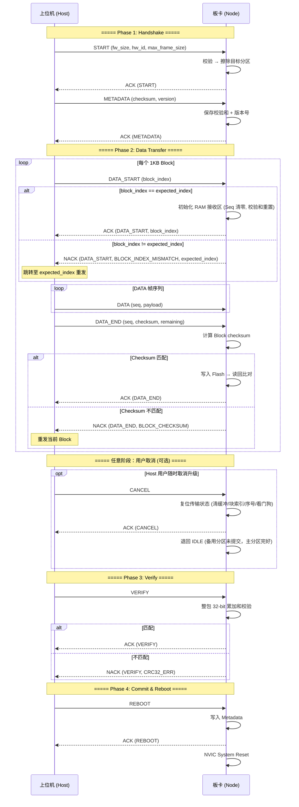

# STM32G474 Bootloader 通信协议规范

| 项目 | 信息 |
|------|------|
| **文档版本** | V1.3.1 |
| **作者** | maximillian |
| **创建日期** | 2026-07-07 |
| **最后更新** | 2026-07-10 |
| **目标 MCU** | STM32G474RBTx (Cortex-M4, 128KB Flash) |
| **传输层** | CAN 2.0B / CAN FD (ISO 11898-1:2015) |

---

## 目录

1. [系统架构](#1-系统架构)
2. [Flash 分区布局](#2-flash-分区布局)
3. [通信链路层](#3-通信链路层)
4. [协议帧定义](#4-协议帧定义)
5. [升级流程](#5-升级流程)
6. [超时与错误处理](#6-超时与错误处理)
7. [启动引导决策](#7-启动引导决策)
8. [附录](#附录)

---

## 1. 系统架构

本 Bootloader 基于 **双 A/B 分区 + 引导元数据区 (Metadata)** 架构，通过 CAN / CAN FD 总线实现固件安全升级。设计目标：在任何升级中断场景下（包括异常断电），系统不会"变砖"。

### 1.1 核心设计原则

| 原则 | 说明 |
|------|------|
| **双分区冗余** | 始终保留一个可启动的 App 分区。新固件写入备用分区，验证通过后切换引导。 |
| **双重校验闭环** | Block 级 16-bit 累加和（传输安全）+ 整包 32-bit 累加和（存储安全）+ Flash 读回比对。 |
| **断点续传** | Block 粒度的重传机制。校验失败仅需重传当前 1KB Block。 |
| **CAN FD 自适应** | 兼容经典 CAN (8B) 和 CAN FD (最高 64B)，帧长在握手阶段协商。 |
| **Checksum 固定偏移** | DATA_END 的 16-bit 校验码固定在 Byte 2-3，避免 CAN FD 离散 DLC 尾部填充干扰。 |
| **块对齐与显式握手** | 每个 1KB Block 传输前以 DATA_START 帧显式声明块号，板端校验块号后回带确认索引；块号不匹配时回带期望索引，支持丢包即时响应与**会话内（6s 超时窗口内）**的断点自动寻址。 |

---

## 2. Flash 分区布局

| 区域 | 起始地址 | 大小 | 说明 |
|------|----------|------|------|
| Bootloader | `0x08000000` | 36 KB | 只读，不参与升级。负责校验并引导 App。 |
| App A | `0x08009000` | 40 KB | 主运行分区。 |
| App B | `0x08013000` | 40 KB | 备用分区。新固件写入此分区。 |
| Metadata | `0x0801D000` | 4 KB | 引导元数据。对齐最小 Flash 页 (4 KB / 2 KB)。 |

### 2.1 Metadata 结构体

| 偏移 | 字段 | 类型 | 说明 |
|------|------|------|------|
| 0 | `magic` | `uint32_t` | 魔数 `0x424F4F54` ("BOOT") |
| 4 | `boot_partition` | `uint8_t` | 引导分区：`0` = A，`1` = B |
| 5 | `upgrade_flag` | `uint8_t` | `0` = 正常，`1` = 升级中，`2` = 待验证 |
| 6 | `version` | `uint16_t` | 固件版本号 |
| 8 | `fw_size` | `uint32_t` | 固件实际大小（字节） |
| 12 | `fw_checksum` | `uint32_t` | 整包 32-bit 累加和 |
| 16 | `reserved[2]` | `uint32_t[2]` | 预留 |

---

## 3. 通信链路层

### 3.1 CAN 标识符分配

| CAN ID | 方向 | 帧类型 | 说明 |
|--------|------|--------|------|
| `0x701` (可配置) | Host → Node | 标准帧 (11-bit) | 命令帧、数据帧 |
| `0x702` (Host ID + 1) | Node → Host | 标准帧 (11-bit) | 应答帧 (ACK / NACK) |

> 上位机支持自定义 Host→Node CAN ID（默认 `0x701`），Node→Host 自动设为 `Host ID + 1`。MCU 侧固定为 `0x701`/`0x702`。

### 3.2 帧物理长度协商

| 物理帧长度 | 载荷 (D = Length − 2) | 说明 |
|-----------|----------------------|------|
| 8 | 6 | 经典 CAN |
| 12 | 10 | CAN FD |
| 16 | 14 | CAN FD |
| 20 | 18 | CAN FD |
| 24 | 22 | CAN FD |
| 32 | 30 | CAN FD |
| 48 | 46 | CAN FD |
| 64 | 62 | CAN FD |

### 3.3 帧通用结构

| Byte 0 | Byte 1 | Byte 2 ~ (N−1) |
|--------|--------|-----------------|
| Command | Sequence | Payload |

DATA / DATA_END 帧使用 2 字节协议头，其余帧（START、METADATA、VERIFY、REBOOT、ACK、NACK）无 Sequence 字段，各字段按帧定义排列。

---

## 4. 协议帧定义

### 4.1 命令字一览

| 命令字 | 宏定义 | 方向 | 说明 |
|--------|--------|------|------|
| `0x01` | `BOOT_CMD_START` | H→N | 开始升级（协商参数） |
| `0x02` | `BOOT_CMD_METADATA` | H→N | 校验和 + 版本号 |
| `0x03` | `BOOT_CMD_DATA` | H→N | 数据帧 |
| `0x04` | `BOOT_CMD_VERIFY` | H→N | 整包校验和验证 |
| `0x05` | `BOOT_CMD_REBOOT` | H→N | 写入 Metadata 后复位 |
| `0x06` | `BOOT_CMD_CANCEL` | H→N | 取消升级，任意状态安全退回 IDLE |
| `0x07` | `BOOT_CMD_DATA_START` | H→N | 块传输启动（携带 block_index） |
| `0x08` | `BOOT_CMD_DATA_END` | H→N | 1KB Block 尾帧（含 16-bit checksum） |
| `0x10` | `BOOT_CMD_ACK` | N→H | 肯定应答 |
| `0x11` | `BOOT_CMD_NACK` | N→H | 否定应答 |

### 4.2 START 帧 (0x01)

固定 8 字节。

| Byte 0 | Byte 1 | Byte 2 | Byte 3 | Byte 4 | Byte 5 | Byte 6 | Byte 7 |
|--------|--------|--------|--------|--------|--------|--------|--------|
| `0x01` | fw_total_size (MSB) | | | (LSB) | hw_compat_id (MSB) | hw_compat_id (LSB) | max_frame_size |

| 字段 | 偏移 | 长度 | 说明 |
|------|------|------|------|
| Command | Byte 0 | 1 | `0x01` |
| fw_total_size | Byte 1-4 | 4 | 固件总大小（uint32, 大端序） |
| hw_compat_id | Byte 5-6 | 2 | 硬件兼容 ID（uint16, 大端序） |
| max_frame_size | Byte 7 | 1 | 单帧物理长度，必须来自 §3.2 集合 |

**校验规则：** frame_size 合法 → hw_compat_id 匹配 → 0 < fw_size ≤ 40KB → 擦除目标分区 → ACK(START)。

### 4.3 METADATA 帧 (0x02)

| Byte 0 | Byte 1 | Byte 2 | Byte 3 | Byte 4 | Byte 5 | Byte 6 |
|--------|--------|--------|--------|--------|--------|--------|
| `0x02` | fw_checksum (MSB) | | | (LSB) | fw_version (MSB) | fw_version (LSB) |

| 字段 | 偏移 | 长度 | 说明 |
|------|------|------|------|
| Command | Byte 0 | 1 | `0x02` |
| fw_checksum | Byte 1-4 | 4 | 32-bit 累加和 `sum(fw_data) & 0xFFFFFFFF`（大端序） |
| fw_version | Byte 5-6 | 2 | 固件版本号（uint16, 大端序） |

### 4.4 DATA 帧 (0x03)

| Byte 0 | Byte 1 | Byte 2 ~ (N−1) |
|--------|--------|------------------|
| `0x03` | Sequence (0~255) | Payload (D bytes, 固件数据) |

载荷大小 D = Max_Frame_Size − 2。Sequence 每个 Block 内从 0 递增。收到错序帧（期望 Seq N 却收到 Seq N+1）时，板端立即回复 NACK 并在 Byte 3-4 回带当前期望块号，Host 据此中止后续无效子帧并重新对齐（见 §6.3）。

### 4.5 DATA_START 帧 (0x07)

块传输启动帧。每个 1KB Block 的 DATA 帧序列发送**之前**，上位机先发送本帧显式声明即将传输的块号，
板端据此初始化接收区并对齐块索引。固定 8 字节经典 CAN 帧。

| Byte 0 | Byte 1 | Byte 2 | Byte 3 | Byte 4 | Byte 5 | Byte 6 | Byte 7 |
|--------|--------|--------|--------|--------|--------|--------|--------|
| `0x07` | `0x00` (保留) | block_index (MSB) | block_index (LSB) | `0x00` | `0x00` | `0x00` | `0x00` |

| 字段 | 偏移 | 长度 | 说明 |
|------|------|------|------|
| Command | Byte 0 | 1 | `0x07` |
| Reserved | Byte 1 | 1 | 保留，固定 `0x00` |
| block_index | Byte 2-3 | 2 | 当前 Block 序号（uint16, 大端序），从 0 递增 |
| Padding | Byte 4-7 | 4 | 零填充 |

**处理规则：** 板端将 `block_index` 与其内部 `expected_block_index` 比对——匹配则初始化 RAM 接收区
（清 Sequence、清块累加缓冲）并回复 ACK（Byte 3-4 回带已确认块号，见 §4.8）；不匹配则回复
NACK `BLOCK_INDEX_MISMATCH (0x0D)`（Byte 3-4 回带板端当前期望的块号），上位机据此自动跳转寻址。

### 4.6 DATA_END 帧 (0x08)

1KB Block 尾帧，**Checksum 固定在 Byte 2-3**。

| Byte 0 | Byte 1 | Byte 2 | Byte 3 | Byte 4 ~ (N−1) |
|--------|--------|--------|--------|-----------------|
| `0x08` | Sequence | checksum_hi | checksum_lo | Remaining Data |

| 字段 | 偏移 | 长度 | 说明 |
|------|------|------|------|
| Command | Byte 0 | 1 | `0x08` |
| Sequence | Byte 1 | 1 | 最后一帧序号 |
| checksum | Byte 2-3 | 2 | 整个 1KB Block 的 16-bit 累加和（大端序） |
| Remaining Data | Byte 4+ | R | 剩余数据（板端以可用空间封顶，兼容 DLC 填充） |

**CAN FD DLC 填充处理：** DLC 为离散值 {8,12,16,20,24,32,48,64}。上位机不足时零填充。板端以 `min(rem_len, 1024 − block_acc)` 截断拷贝，零填充不影响累加和。

**Block 数据量计算：**

| CAN 类型 | Max_Frame | 载荷 D | DATA 帧 | DATA 累计 | DATA_END 剩余 | 总帧 |
|----------|-----------|--------|---------|-----------|---------------|------|
| Classic | 8 | 6 | 170 | 1020 | 4 | 171 |
| CAN FD | 64 | 62 | 16 | 992 | 32 | 17 |

### 4.7 VERIFY 帧 (0x04) / REBOOT 帧 (0x05) / CANCEL 帧 (0x06)

| Byte 0 | Byte 1 |
|--------|--------|
| `0x04` (VERIFY) | `0x00` — 触发整包校验和验证 |
| `0x05` (REBOOT) | `0x00` — 写入 Metadata 后系统复位 |
| `0x06` (CANCEL) | `0x00` — 取消升级，任意状态复位并退回 IDLE |

**CANCEL 处理：** 板端在**任意状态**收到 CANCEL 即复位传输状态（清 RAM 缓冲、块索引、序号、看门狗），
回复 `ACK(CANCEL)` 并退回 `IDLE`，随后可立即接受新的 START。因备用分区尚未提交、主运行分区完好，
取消不影响现有可启动固件。上位机用户取消升级时应发送本帧，令节点立即退出而非等待 6s 全局超时。

### 4.8 ACK 帧 (0x10) / NACK 帧 (0x11)

板卡应答帧，始终使用 8 字节经典 CAN 帧。

| Byte 0 | Byte 1 | Byte 2 | Byte 3 | Byte 4 | Byte 5 ~ 7 |
|--------|--------|--------|--------|--------|------------|
| `0x10` (ACK) | 应答的命令字 | `0x00` (成功) | idx (MSB) | idx (LSB) | `0x00` (填充) |

| Byte 0 | Byte 1 | Byte 2 | Byte 3 | Byte 4 | Byte 5 ~ 7 |
|--------|--------|--------|--------|--------|------------|
| `0x11` (NACK) | 被拒的命令字 | error_code | idx (MSB) | idx (LSB) | `0x00` (填充) |

**Byte 3-4（块号载荷）语义：** 仅对 DATA_START 应答有效，其余应答保持 `0x00` 填充。

- **ACK(DATA_START)**：板端验证块号匹配后初始化 RAM 接收区、重置局部状态（Sequence 清零、校验和重置），
  Byte 3-4 回带**已确认的** `block_index`（大端序）。
- **NACK(DATA_START, 0x0D)**：板端块号不匹配（`M != expected_index`）时，Byte 3-4 回带板端**当前实际期望的**
  `expected_index`（大端序），供上位机自动跳转寻址、从断点续传。

### 4.9 NACK 错误码

| 错误码 | 枚举 | 说明 |
|--------|------|------|
| `0x00` | `OK` | 成功（仅 ACK） |
| `0x01` | `BLOCK_CHECKSUM` | Block checksum 失败 → 重发当前 Block |
| `0x02` | `FLASH_WRITE_ERR` | Flash 写入失败 → 终止 |
| `0x03` | `FLASH_VERIFY_ERR` | Flash 读回比对失败 → 终止 |
| `0x04` | `CRC32_ERR` | 整包校验和失败 → 终止 |
| `0x05` | `INVALID_FRAME` | 帧格式无效 |
| `0x06` | `INVALID_STATE` | 状态机不允许此命令 |
| `0x07` | `TIMEOUT` | 传输超时 |
| `0x08` | `HW_MISMATCH` | 硬件 ID 不匹配 |
| `0x09` | `FLASH_ERASE_ERR` | Flash 擦除失败 |
| `0x0A` | `FLASH_READ_ERR` | Flash 读取失败 |
| `0x0B` | `FRAME_SIZE` | 帧长度不支持 |
| `0x0C` | `FW_TOO_BIG` | 固件超分区容量 |
| `0x0D` | `BLOCK_INDEX_MISMATCH` | 包号不匹配，并在负载中返回期望的包号 |

---

## 5. 升级流程

### 5.1 完整升级时序

### 5.2 断点续传（会话级）

每个 Block 以 DATA_START 帧显式对齐块号：板端维护 `expected_block_index`，仅接受与之匹配的块。

- **块内重传**：Block Checksum 失败时板端回 NACK `BLOCK_CHECKSUM`，上位机仅重发当前 1KB Block。
- **丢包即时寻址**：块号不匹配、块内错序、或局部看门狗超时时，板端回复**携带 `expected_index`** 的
  NACK（`BLOCK_INDEX_MISMATCH` / `INVALID_FRAME` / `TIMEOUT`），上位机直接跳转到该块重发，无需从头重来。
- **会话内瞬断续传**：链路瞬时中断但**尚未触发 6s 全局会话超时**时，板端仍停留 `DATA_TRANSFER` 且
  `expected_block_index` 完好；上位机重连后对每个 Block 发送 DATA_START 即可从断点块恢复（命中→ACK，
  不命中→NACK 回带期望块号）。100ms 局部看门狗保证节点在此期间持续可响应。

> **续传边界（重要）**：断点续传是**会话级**的，仅在 6s 全局超时窗口内有效。一旦连续无 CAN 活动
> **超过 6s**，板端复位回 `IDLE`（见 §6.3）；此后 DATA_START 不再被受理，必须重新发起 `START`，而
> START 会擦除目标分区并从块 0 全量重传。**节点复位（掉电/看门狗）会丢失 RAM 进度，同样需从 0 重传**——
> 本版本不实现跨复位的持久化续传。

重试策略：上位机对同一 Block 校验失败最多重试 **3 次**（`MAX_RETRIES`）；节点无独立重传计数器，靠
6s 全局超时兜底。上位机侧另设 6s 失联判定：节点连续无响应达 6s 即中止升级。

### 5.3 最后一个不完整 Block

1. 上位机按实际剩余字节发送，不足 1024 部分零填充
2. 板端 16-bit checksum 覆盖全部 1024 字节（零不改变累加和）
3. Flash 写入 1024 字节，尾部为零填充
4. 整包 32-bit checksum 仅读 fw_total_size 字节，不含尾部的零填充

### 5.4 用户取消（CANCEL）

上位机可在升级的**任意阶段**（握手、数据传输、待验证、待复位）发送 `CANCEL (0x06)` 主动中止：

1. 板端收到 CANCEL 后立即复位传输状态（清 RAM 缓冲、`expected_block_index`、Sequence、块看门狗），
   回复 `ACK(CANCEL)` 并退回 `IDLE`，随后可立即接受新的 START。
2. 因新固件仅写入**备用分区**且尚未提交 Metadata，取消不影响主运行分区的现有可启动固件。
3. 上位机侧应在用户点击取消时即时发出本帧，令节点立刻退出，而非被动等待 6s 全局会话超时。
   若 CANCEL 帧本身丢失，6s 全局超时仍会兜底将节点复位回 IDLE。

---

## 6. 超时与错误处理

### 6.1 超时参数

| 参数 | 值 | 说明 |
|------|-----|------|
| 全局会话超时 | 6 秒 | 无 CAN 活动 → 复位到 IDLE（会话放弃边界） |
| Block 局部看门狗 | 100 ms | 块活跃期帧间隔溢出（如尾帧丢失）→ NACK(TIMEOUT, expected_index) + 安全等待 |
| Block 帧间隔超时 | 100 ms | 帧间隔 > 100ms → 请求重传 |
| 同块最大重试 | 3 次 | 上位机侧；节点无独立重试计数，靠 6s 全局超时兜底 |
| IDLE 状态 | 永不超时 | 永久等待 START |

### 6.2 状态机（5 状态）

| 状态 | 接受的命令 | 处理 |
|------|-----------|------|
| `IDLE` | START | 校验 → 擦除 → ACK/NACK |
| `START` | METADATA / START | 保存元数据 / 重新协商 |
| `DATA_TRANSFER` | DATA / DATA_END | 累积数据 / checksum → 写入 → ACK/NACK |
| `VERIFY_PENDING` | VERIFY | 整包 checksum → ACK/NACK |
| `REBOOT_PENDING` | REBOOT | 写 Metadata → ACK → 复位 |

状态转移：

| 从 → 到 | IDLE | START | DATA | VERIFY | REBOOT |
|---------|:---:|:---:|:---:|:---:|:---:|
| **IDLE** | — | START | 超时 | 超时 | 超时 |
| **START** | START/超时 | — | METADATA | | |
| **DATA** | 错误/超时 | | — | 全部收完 | |
| **VERIFY** | 失败/超时 | | | — | VERIFY |
| **REBOOT** | REBOOT | | | | — |

### 6.3 错误恢复

| 错误场景 | 板卡行为 | 恢复方式 |
|---------|---------|---------|
| Block Checksum 不匹配 | NACK, 复位 Block | 重发当前 Block |
| 整包 Checksum 不匹配 | NACK, 回到 IDLE | 重新发起 START |
| Flash 写入/校验失败 | NACK, 回到 IDLE | 检查硬件 |
| 帧间隔超时 | NACK (BLOCK_CHECKSUM), 重传 | 等待主机重发 |
| 尾帧/结束帧丢失 | 100ms 局部看门狗 → NACK(TIMEOUT, expected_index) + 安全等待 | Host 重发 DATA_START 重同步 |
| 6s 内瞬时断连 | 保留 expected_block_index，停留 DATA_TRANSFER | Host 经 DATA_START 会话级续传 |
| 全局会话超时 (>6s) | 复位到 IDLE | 重新发起 START |
| 用户主动取消 | 收到 CANCEL → 复位并退回 IDLE | 立即可重新 START，免等 6s |
| 错序/残留帧 | 立即 NACK 带期望块号，不再静默丢弃 | 主机据 NACK 即时中止并重同步 |

> **丢包即时恢复：** 一旦检测到错序帧（即收到 Seq N+1 但期望 Seq N），板端立即发送
> `NACK (INVALID_FRAME, 0x05)` 并在 Byte 3-4 回带当前期望块号；块号不匹配时发送
> `NACK (BLOCK_INDEX_MISMATCH, 0x0D)`；局部看门狗溢出时发送 `NACK (TIMEOUT, 0x07)`——
> 三者均携带期望块号。**不再采用静默丢弃策略**，Host 据此毫秒级中止无效子帧并重同步。

### 6.4 CAN Bus-Off 自恢复

物理链路断开或恶劣电磁环境导致节点连续发送失败时，FDCAN 内核会累加 TEC 至 256 进入 Bus-Off，
自动置位 `CCCR.INIT` 离线。节点侧驱动周期性（约 100ms）检测 Bus-Off 状态，一旦发现即经
`HAL_FDCAN_Stop/Start` 清 `CCCR.INIT`，触发内核 128×11 隐性位恢复序列，自动重新使能收发——
**无需芯片复位**，滤波器与接收回调保持不变。物理连接恢复后节点即可继续参与升级会话。

---

## 7. 启动引导决策

上电后按以下条件判断：

| 条件 | 结果 |
|------|------|
| Metadata magic ≠ `0x424F4F54` | 进入 Bootloader |
| `upgrade_flag` ≠ 0 | 进入 Bootloader |
| App 分区 32-bit checksum 验证失败 | 进入 Bootloader |
| App 分区 checksum 验证通过 | 跳转 App |

---

## 附录

### A. 经典 CAN 单 Block 传输 (8 字节帧)

| 帧序号 | 格式 | 说明 |
|--------|------|------|
| — | `[0x07] [0x00] [idx_H] [idx_L] [4B padding]` | DATA_START, 声明块号 block_index |
| 0 ~ 169 | `[0x03] [seq] [6B payload]` | 170 帧 DATA, 累计 1020 字节 |
| 170 | `[0x08] [0xAA] [cs_H] [cs_L] [4B remaining]` | DATA_END, checksum 固定 Byte 2-3 |

> DATA_START 先于 DATA 序列发送，其 block_index 与板端 `expected_block_index` 对齐；DATA 帧的 Sequence 仍从 0 顺延。

### B. CAN FD 单 Block 传输 (64 字节帧)

| 帧序号 | 格式 | 说明 |
|--------|------|------|
| — | `[0x07] [0x00] [idx_H] [idx_L] [4B padding]` | DATA_START (8B 经典帧), 声明块号 block_index |
| 0 ~ 15 | `[0x03] [seq] [62B payload]` | 16 帧 DATA, 累计 992 字节 |
| 16 | `[0x08] [0x10] [cs_H] [cs_L] [32B remaining] [28B padding]` | DATA_END, 尾 28 字节零填充 |

> DATA_START 先于 DATA 序列发送，其 block_index 与板端 `expected_block_index` 对齐；DATA 帧的 Sequence 仍从 0 顺延。

### C. 关键常数

| 常量 | 值 | 定义位置 |
|------|-----|----------|
| CAN ID Host→Node | `0x701` (可配置) | `boot_transport.h` |
| CAN ID Node→Host | `0x702` (Host ID + 1) | `boot_transport.h` |
| 协议头长度 | 2 字节 | `BOOT_FRAME_HEADER_LEN` |
| Block 大小 | 1024 字节 | `BOOT_BLOCK_SIZE` |
| 帧长集合 | `{8,12,16,20,24,32,48,64}` | `s_supported_frame_sizes[]` |
| DATA_START 命令 | `0x07` | `BOOT_CMD_DATA_START` |
| CANCEL 命令 | `0x06` | `BOOT_CMD_CANCEL` |
| 块号不匹配错误码 | `0x0D` | `BOOT_ERR_BLOCK_INDEX` |
| Bootloader | 36 KB | `BOOT_FLASH_BOOT_SIZE` |
| App 分区 | 40 KB | `BOOT_FLASH_APP_SIZE` |
| Metadata | 4 KB | `BOOT_FLASH_META_SIZE` |
| Magic | `0x424F4F54` | `BOOT_METADATA_MAGIC` |
| 全局超时 | 6 秒 | `BOOT_FSM_TIMEOUT_MS` |
| Block 帧间隔超时 | 100 ms | `BOOT_BLOCK_TIMEOUT_MS` |
| 同块最大重试（上位机） | 3 次 | `MAX_RETRIES` (worker.py) |
