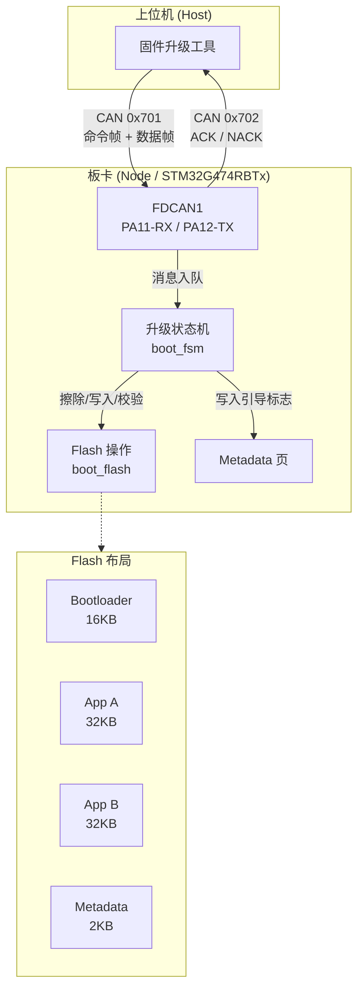
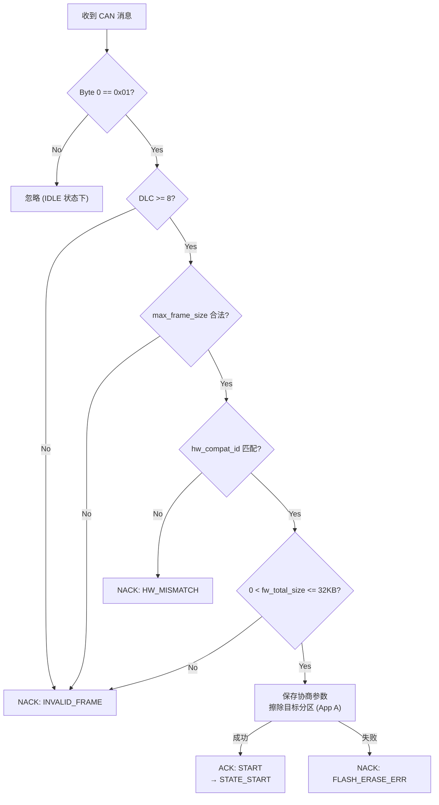
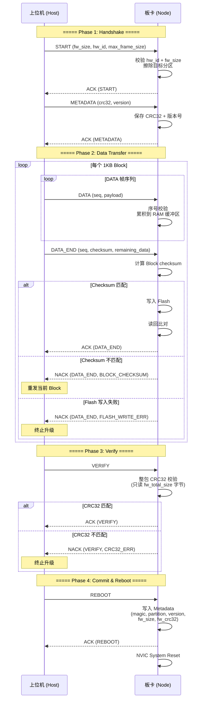
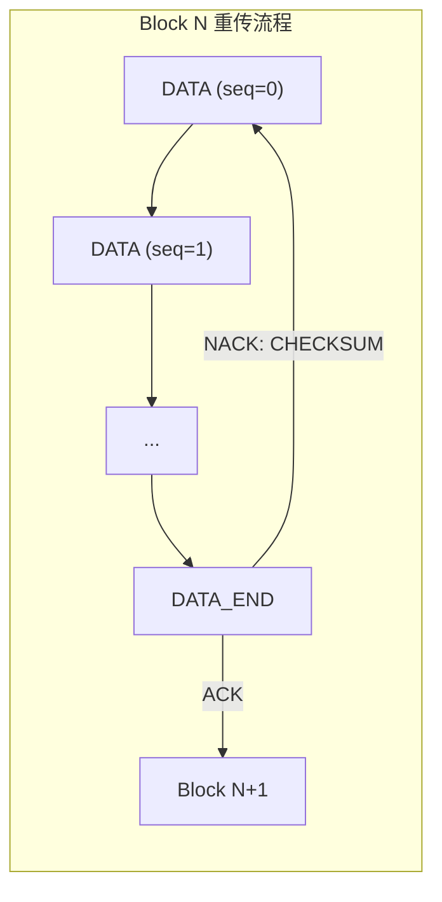
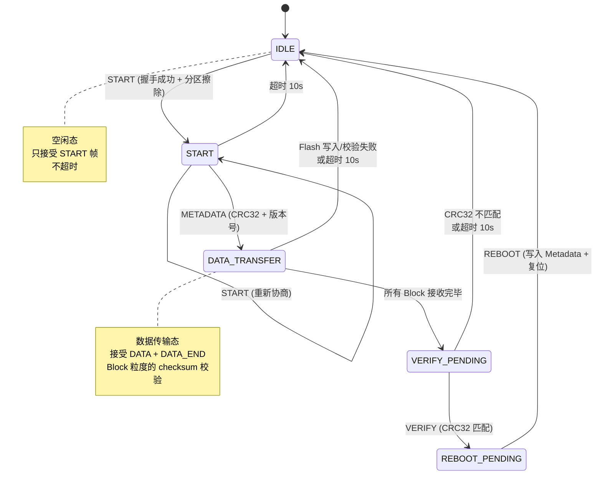
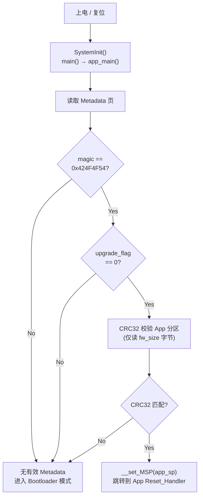

# STM32G474 Bootloader 通信协议规范

> **Document Version**: V1.0.0
> **Target MCU**: STM32G474RBTx (Cortex-M4, 128KB Flash)
> **Transport Layer**: CAN 2.0B / CAN FD (ISO 11898-1:2015)
> **Last Updated**: 2026-07-06

---

## 目录

1. [系统架构](#1-系统架构)
2. [Flash 分区布局](#2-flash-分区布局)
3. [通信链路层](#3-通信链路层)
4. [协议帧定义](#4-协议帧定义)
5. [升级流程](#5-升级流程)
6. [状态机设计](#6-状态机设计)
7. [错误处理与超时](#7-错误处理与超时)
8. [启动引导决策](#8-启动引导决策)

---

## 1. 系统架构

本 Bootloader 基于 **双 A/B 分区 + 引导元数据区 (Metadata)** 架构，通过 CAN / CAN FD 总线实现固件的安全升级。设计目标是：在任何升级中断场景下（包括异常断电），系统不会"变砖"。



### 1.1 核心设计原则

| 原则 | 说明 |
|------|------|
| **双分区冗余** | 始终保留一个可启动的 App 分区。新固件写入备用分区，验证通过后切换引导。 |
| **双重校验闭环** | Block 级 16-bit 累加和（传输安全）+ 整包 CRC32 + Flash 读回比对（存储安全）。 |
| **断点续传** | Block 粒度的重传机制。校验失败的 Block 仅需重传当前 1KB，无需从头开始。 |
| **CAN FD 自适应** | 协议兼容经典 CAN (8B) 和 CAN FD (最高 64B)，帧长在握手阶段协商。 |
| **Checksum 固定偏移** | DATA_END 帧的 16-bit 校验码固定在 Byte 2-3，避免 CAN FD 尾部填充干扰。 |

---

## 2. Flash 分区布局

```mermaid
block-beta
    columns 1
    block:FLASH["128 KB Flash @ 0x08000000"]
        block:Boot["Bootloader 区 (16 KB)"]
            B0["0x08000000"]
            space
            B1["0x08004000"]
        end
        block:AppA["App A 分区 (32 KB)"]
            A0["0x08004000"]
            space
            A1["0x0800C000"]
        end
        block:AppB["App B 分区 (32 KB)"]
            AA0["0x0800C000"]
            space
            AA1["0x08014000"]
        end
        block:Meta["Metadata 页 (2 KB)"]
            M0["0x08014000"]
            space
            M1["0x08016000"]
        end
    end
```



| 区域 | 起始地址 | 大小 | 说明 |
|------|----------|------|------|
| Bootloader | `0x08000000` | 16 KB | 只读，不参与升级。负责校验并引导 App。 |
| App A | `0x08004000` | 32 KB | 主运行分区。 |
| App B | `0x0800C000` | 32 KB | 备用分区。新固件先写入此分区。 |
| Metadata | `0x08014000` | 2 KB | 引导元数据。独立 Flash 页，存放启动参数。 |

### 2.1 Metadata 结构体

| 偏移 | 字段 | 类型 | 说明 |
|------|------|------|------|
| 0 | `magic` | `uint32_t` | 魔数 `0x424F4F54` ("BOOT")，标识有效 metadata |
| 4 | `boot_partition` | `uint8_t` | 当前引导分区：`0` = A, `1` = B |
| 5 | `upgrade_flag` | `uint8_t` | `0` = 正常, `1` = 升级中, `2` = 升级完成待验证 |
| 6 | `version` | `uint16_t` | 固件版本号 |
| 8 | `fw_size` | `uint32_t` | 固件实际大小（字节） |
| 12 | `fw_crc32` | `uint32_t` | 整包 CRC32 校验值 |
| 16 | `reserved[2]` | `uint32_t[2]` | 预留 |

---

## 3. 通信链路层

### 3.1 CAN 标识符分配

| CAN ID | 方向 | 帧类型 | 说明 |
|--------|------|--------|------|
| `0x701` | Host → Node | 标准帧 (11-bit) | 命令帧、数据帧 |
| `0x702` | Node → Host | 标准帧 (11-bit) | 应答帧 (ACK / NACK) |

### 3.2 帧物理长度协商

CAN FD 协议定义了离散的有效数据长度集合。本次升级所允许的帧物理长度在握手阶段协商，取值必须来自以下集合：

| 物理帧长度 | 载荷大小 (D = Length - 2) | 适用场景 |
|-----------|--------------------------|----------|
| 8 字节 | 6 字节 | 经典 CAN |
| 12 字节 | 10 字节 | CAN FD |
| 16 字节 | 14 字节 | CAN FD |
| 20 字节 | 18 字节 | CAN FD |
| 24 字节 | 22 字节 | CAN FD |
| 32 字节 | 30 字节 | CAN FD |
| 48 字节 | 46 字节 | CAN FD |
| 64 字节 | 62 字节 | CAN FD |

> **公式：** $D = \text{Max\_Frame\_Size} - 2$（扣除 2 字节协议头）

### 3.3 帧通用结构

每一帧的前 2 字节为固定协议头：

| Byte 0 | Byte 1 | Byte 2 ~ (N-1) |
|--------|--------|----------------|
| Command (命令字) | Sequence (包序号) | Payload (取决于命令类型) |

- **Command**：标识帧类型（见 [§4 协议帧定义](#4-协议帧定义)）。
- **Sequence**：包序号（0~255），仅 DATA 帧使用；非 DATA 帧填 `0x00`。

---

## 4. 协议帧定义

### 4.1 命令字一览

| 命令字 | 宏定义 | 方向 | 说明 |
|--------|--------|------|------|
| `0x01` | `BOOT_CMD_START` | Host → Node | 开始升级（协商参数） |
| `0x02` | `BOOT_CMD_METADATA` | Host → Node | 固件元数据（CRC32 + 版本号） |
| `0x03` | `BOOT_CMD_DATA` | Host → Node | 数据帧 |
| `0x04` | `BOOT_CMD_VERIFY` | Host → Node | 整包 CRC32 校验请求 |
| `0x05` | `BOOT_CMD_REBOOT` | Host → Node | 复位重启 |
| `0x08` | `BOOT_CMD_DATA_END` | Host → Node | 1KB 分块尾帧（含 Checksum） |
| `0x10` | `BOOT_CMD_ACK` | Node → Host | 肯定应答 |
| `0x11` | `BOOT_CMD_NACK` | Node → Host | 否定应答 |

### 4.2 START 帧 (0x01)

握手帧，协商升级参数并触发目标分区擦除。固定 8 字节，同时兼容经典 CAN 和 CAN FD。

| Byte 0 | Byte 1 | Byte 2 | Byte 3 | Byte 4 | Byte 5 | Byte 6 | Byte 7 |
|--------|--------|--------|--------|--------|--------|--------|--------|
| 0x01 (START) | fw_total_size (MSB) | fw_total_size | fw_total_size | fw_total_size (LSB) | hw_compat_id (MSB) | hw_compat_id (LSB) | max_frame_size |

| 字段 | 偏移 | 长度 | 说明 |
|------|------|------|------|
| Command | Byte 0 | 1 | `0x01` |
| fw_total_size | Byte 1-4 | 4 | 固件总大小（uint32, 大端序），单位：字节 |
| hw_compat_id | Byte 5-6 | 2 | 硬件兼容 ID（uint16, 大端序），不匹配则拒绝 |
| max_frame_size | Byte 7 | 1 | 单帧物理长度，必须来自 §3.2 的离散集合 |

**板卡侧校验逻辑：**



### 4.3 METADATA 帧 (0x02)

传输固件的全局 CRC32 校验码和版本号。

| Byte 0 | Byte 1 | Byte 2 | Byte 3 | Byte 4 | Byte 5 | Byte 6 |
|--------|--------|--------|--------|--------|--------|--------|
| 0x02 (METADATA) | fw_crc32 (MSB) | fw_crc32 | fw_crc32 | fw_crc32 (LSB) | fw_version (MSB) | fw_version (LSB) |

| 字段 | 偏移 | 长度 | 说明 |
|------|------|------|------|
| Command | Byte 0 | 1 | `0x02` |
| fw_crc32 | Byte 1-4 | 4 | 整包固件 CRC32（uint32, 大端序） |
| fw_version | Byte 5-6 | 2 | 固件版本号（uint16, 大端序） |

### 4.4 DATA 帧 (0x03)

承载固件数据。每帧载荷大小 $D = \text{Max\_Frame\_Size} - 2$。

| Byte 0 | Byte 1 | Byte 2 ~ (N-1) |
|--------|--------|------------------|
| 0x03 (DATA) | Sequence (0~255) | Payload (D bytes, 固件数据) |

| 字段 | 偏移 | 长度 | 说明 |
|------|------|------|------|
| Command | Byte 0 | 1 | `0x03` |
| Sequence | Byte 1 | 1 | 包序号 (0~255)，每个 Block 内从 0 开始递增 |
| Payload | Byte 2+ | D | 固件数据载荷 |

**板卡校验规则：**
- 序号必须等于 `expected_seq`，否则 NACK (`INVALID_FRAME`) 并复位当前 Block 计数。
- 单帧数据不能使累积缓冲区达到 1024 字节（满 1KB 必须由 DATA_END 触发），否则 NACK。

### 4.5 DATA_END 帧 (0x08)

标识一个 1KB Block 的结束。**Checksum 固定在 Byte 2-3，彻底避开 CAN FD 离散长度的尾部填充干扰。**

| Byte 0 | Byte 1 | Byte 2 | Byte 3 | Byte 4 ~ (N-1) |
|--------|--------|--------|--------|-----------------|
| 0x08 (DATA_END) | Sequence (末帧序号) | checksum_hi | checksum_lo | Remaining Data (R bytes) |
| | | (uint16 checksum, 大端序, 固定位置) | | |

| 字段 | 偏移 | 长度 | 说明 |
|------|------|------|------|
| Command | Byte 0 | 1 | `0x08` |
| Sequence | Byte 1 | 1 | 当前 Block 最后一帧的序号 |
| checksum | Byte 2-3 | 2 | 整个 1KB Block 的 16-bit 累加和校验（大端序） |
| Remaining Data | Byte 4+ | R | 当前 Block 剩余数据（DLC - 4 字节） |

**1KB Block 数据量计算（示例）：**

| CAN 类型 | Max_Frame | 载荷 D | DATA 帧数 | DATA 帧累计 | DATA_END 剩余 | 总帧数 |
|----------|-----------|--------|-----------|-------------|---------------|--------|
| Classic  | 8         | 6      | 170       | 1020 字节   | 4 字节        | 171    |
| CAN FD   | 64        | 62     | 16        | 992 字节    | 32 字节       | 17     |

### 4.6 VERIFY 帧 (0x04) / REBOOT 帧 (0x05)

| Byte 0 | Byte 1 | 说明 |
|--------|--------|------|
| 0x04 | 0x00 | VERIFY: 触发整包 CRC32 校验 |
| 0x05 | 0x00 | REBOOT: 写入 Metadata 后系统复位 |

### 4.7 ACK 帧 (0x10) / NACK 帧 (0x11)

板卡对每条命令的应答。

**ACK 帧格式：**

| Byte 0 | Byte 1 | Byte 2 | Byte 3 ~ 7 |
|--------|--------|--------|------------|
| 0x10 (ACK) | cmd (应答的命令字) | 0x00 (成功) | 0x00 (填充) |

**NACK 帧格式：**

| Byte 0 | Byte 1 | Byte 2 | Byte 3 ~ 7 |
|--------|--------|--------|------------|
| 0x11 (NACK) | cmd (被拒的命令字) | error_code (错误码) | 0x00 (填充) |

> ACK/NACK 始终使用经典 CAN 8 字节帧，不受 Max_Frame_Size 协商影响。

### 4.8 NACK 错误码

| 错误码 | 枚举 | 说明 | 上位机处理建议 |
|--------|------|------|---------------|
| `0x00` | `BOOT_STATUS_OK` | 成功（仅 ACK 使用） | - |
| `0x01` | `BOOT_STATUS_BLOCK_CHECKSUM` | Block 累加和校验失败 | 重发当前 Block |
| `0x02` | `BOOT_STATUS_FLASH_WRITE_ERR` | Flash 写入失败 | 终止升级 |
| `0x03` | `BOOT_STATUS_FLASH_VERIFY_ERR` | Flash 读回比对失败 | 终止升级 |
| `0x04` | `BOOT_STATUS_CRC32_ERR` | 整包 CRC32 校验失败 | 终止升级，重试整体 |
| `0x05` | `BOOT_STATUS_INVALID_FRAME` | 帧格式无效 | 检查帧格式 |
| `0x06` | `BOOT_STATUS_INVALID_STATE` | 状态机不允许此命令 | 检查协议流程 |
| `0x07` | `BOOT_STATUS_TIMEOUT` | 传输超时 | 重新发起 START |
| `0x08` | `BOOT_STATUS_HW_MISMATCH` | 硬件 ID 不匹配 | 确认目标设备 |
| `0x09` | `BOOT_STATUS_FLASH_ERASE_ERR` | Flash 擦除失败 | 检查硬件 |
| `0x0A` | `BOOT_STATUS_FLASH_READ_ERR` | Flash 读取失败 | 检查硬件 |

---

## 5. 升级流程

### 5.1 完整升级时序



### 5.2 断点续传机制

当上位机收到 `NACK (BLOCK_CHECKSUM)` 时，仅需重发当前 Block 的所有 DATA 帧和 DATA_END 帧。板卡在 Block 校验失败时会自动复位当前 Block 的累积计数器。



### 5.3 最后一个不完整 Block 的处理

固件大小 (`fw_total_size`) 可能不是 1024 的整数倍。板卡端通过以下机制处理：

1. 板卡 Block 之间的 RAM 缓冲区自动清零（`memset` 在 Block 完成后执行）。
2. 上位机按实际剩余字节数发送最后一个 Block 的数据。
3. 板卡接收数据填充到已清零的缓冲区中，尾部字节保持 `0x00`。
4. 16-bit 累加和校验覆盖全部 1024 字节 — 由于零填充不改变累加和结果，checksum 自动匹配。
5. Flash 写入仍为 1024 字节（尾部为零填充）。
6. 整包 CRC32 校验仅读取 `fw_total_size` 字节 — 尾部的零填充不会被计入 CRC32。

---

## 6. 状态机设计

### 6.1 状态转移图



### 6.2 状态转移矩阵

`YES` = 允许转移（守卫函数 = `fsm_always_true`），空白 = 禁止转移。

| 当前状态 →<br/>目标状态 ↓ | IDLE | START | DATA_TRANSFER | VERIFY_PENDING | REBOOT_PENDING |
|:---|:---:|:---:|:---:|:---:|:---:|
| **IDLE** | — | YES | YES | YES | YES |
| **START** | YES | — | | | |
| **DATA_TRANSFER** | | YES | — | | |
| **VERIFY_PENDING** | | | YES | — | |
| **REBOOT_PENDING** | | | | YES | — |

### 6.3 状态行为摘要

| 状态 | 接受的命令 | 处理逻辑 | 响应 |
|------|-----------|----------|------|
| `IDLE` | START | 校验 hw_id, fw_size, frame_size；擦除目标分区 | ACK / NACK |
| `START` | METADATA | 保存 CRC32 + 版本号 | ACK / NACK |
| `START` | START | 重新协商参数（允许重复握手） | ACK |
| `DATA_TRANSFER` | DATA | 序号校验 → 数据累积 | — (无立即响应) |
| `DATA_TRANSFER` | DATA_END | Checksum 校验 → Flash 写入 → 读回比对 | ACK / NACK |
| `VERIFY_PENDING` | VERIFY | 整包 CRC32 校验 | ACK / NACK |
| `REBOOT_PENDING` | REBOOT | 写入 Metadata → 系统复位 | ACK |

---

## 7. 错误处理与超时

### 7.1 超时策略

| 参数 | 值 | 说明 |
|------|-----|------|
| 超时时间 | 10 秒 (2000 ticks × 5ms) | 从最后一次收到有效 CAN 消息开始计时 |
| 超时行为 | 状态机复位到 `IDLE` | 可重新发起 START |
| IDLE 状态 | 永不超时 | 可永久等待升级命令 |


### 7.2 错误恢复矩阵

| 错误场景 | 板卡行为 | 上位机恢复动作 |
|---------|---------|---------------|
| START 帧参数不合法 | NACK, 停留 IDLE | 修正参数后重发 START |
| HW ID 不匹配 | NACK, 停留 IDLE | 确认目标设备 |
| 分区擦除失败 | NACK, 停留 IDLE | 检查硬件 |
| DATA 帧序号不连续 | NACK, 复位当前 Block 计数 | 重发当前 Block |
| DATA 帧填满 1KB (无 DATA_END) | NACK, 复位 Block 计数 | 检查 Block 拆分逻辑 |
| Block Checksum 不匹配 | NACK, 复位 Block 计数 | **仅重发当前 Block** |
| Flash 写入失败 | NACK, 回到 IDLE | 终止升级 |
| Flash 读回校验失败 | NACK, 回到 IDLE | 终止升级 |
| 整包 CRC32 不匹配 | NACK, 回到 IDLE | 终止升级，需重新发起 |
| 非当前状态接受的命令 | NACK (INVALID_STATE) | 检查协议流程 |
| 超时 (10 秒) | 自动回到 IDLE | 重新发起 START |

---

## 8. 启动引导决策

### 8.1 上电引导流程



### 8.2 引导条件摘要

| 条件 | 结果 |
|------|------|
| Metadata magic ≠ `0x424F4F54` | 进入 Bootloader |
| `upgrade_flag` ≠ 0 | 进入 Bootloader |
| App 分区 CRC32 校验失败 | 进入 Bootloader |
| App 分区 CRC32 校验通过 | **跳转 App** |

---

## 附录 A：经典 CAN 单 Block 传输示例 (170 帧 DATA + 1 帧 DATA_END)

```
Frame  0 ~ 169:  [0x03] [0x00~0xA9] [6 bytes payload]     → 累计 1020 字节
Frame  170:       [0x08] [0xAA]      [checksum_hi] [checksum_lo] [4 bytes remaining]
```

Frame 170 解析：
- `Byte 0` = `0x08` → DATA_END
- `Byte 1` = `0xAA` → Sequence = 170
- `Byte 2-3` = uint16 checksum (大端序)
- `Byte 4-7` = 剩余 4 字节数据
- 整帧恰好 8 字节（经典 CAN 最大帧长）

---

## 附录 B：CAN FD (64B) 单 Block 传输示例 (16 帧 DATA + 1 帧 DATA_END)

```
Frame  0 ~ 15:   [0x03] [0x00~0x0F] [62 bytes payload]    → 累计 992 字节
Frame  16:       [0x08] [0x10]      [checksum_hi] [checksum_lo] [32 bytes remaining] [28 bytes padding]
```

Frame 16 解析：
- `Byte 0` = `0x08` → DATA_END
- `Byte 1` = `0x10` → Sequence = 16
- `Byte 2-3` = uint16 checksum (大端序, 固定位置)
- `Byte 4-35` = 剩余 32 字节数据
- `Byte 36-63` = CAN 控制器自动填充 (被板卡忽略)
- 整帧 64 字节（CAN FD 最大帧长）

---

## 附录 C：关键数据常数

| 常量 | 值 | 定义位置 |
|------|-----|----------|
| CAN ID Host→Node | `0x701` | `boot_transport.h` |
| CAN ID Node→Host | `0x702` | `boot_transport.h` |
| 协议头长度 | 2 字节 | `BOOT_FRAME_HEADER_LEN` |
| Block 大小 | 1024 字节 | `BOOT_BLOCK_SIZE` |
| 支持帧长度 | `{8,12,16,20,24,32,48,64}` | `s_supported_frame_sizes[]` |
| Bootloader 分区 | 16 KB (`0x4000`) | `boot_flash.h` |
| App 分区 | 32 KB (`0x8000`) | `boot_flash.h` |
| Metadata 页 | 2 KB (`0x800`) | `boot_flash.h` |
| Metadata 魔数 | `0x424F4F54` | `BOOT_METADATA_MAGIC` |
| 超时时间 | 10 秒 (2000 ticks) | `BOOT_FSM_TIMEOUT_TICKS` |
| 定时器周期 | 5 ms | `BOOT_TASK_PERIOD_MS` |
| CAN RX 队列深度 | 16 | `BOOT_MSG_FIFO_SIZE` |
| 默认 HW Compat ID | `0x0001` | `boot_task.c` |
| 默认目标分区 | App A (0) | `boot_task.c` |
