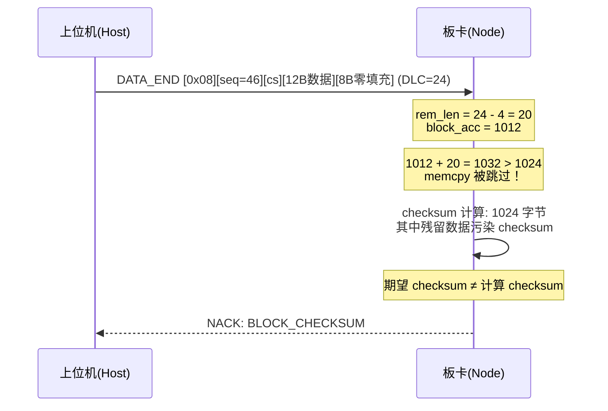
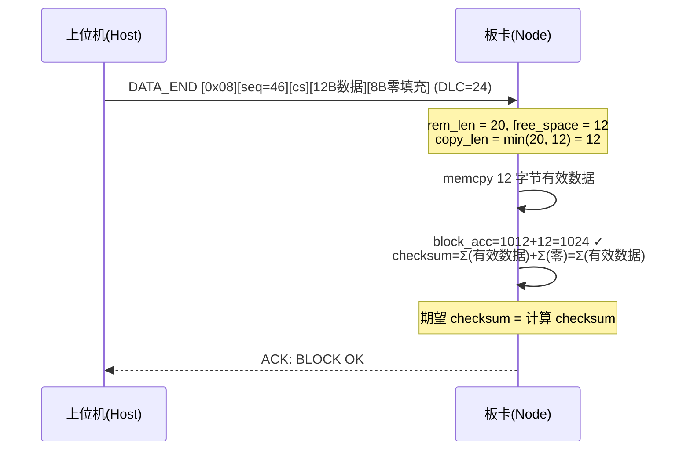

# CAN FD 离散 DLC 导致的 DATA_END 解析问题

## 背景

Bootloader 使用 1KB（1024 字节）数据块传输固件。每个 Block 拆分为 N 帧 DATA + 1 帧 DATA_END。CAN FD 帧的有效数据长度是离散值，当帧长不落在离散集合中时，上位机会填充到下一个离散长度。

## 问题

### CAN FD 离散长度

CAN FD 协议规定有效数据长度只能是以下值：

| DLC 编码 | 有效字节数 |
|----------|-----------|
| 0~8 | 0~8 |
| 9 | 12 |
| 10 | 16 |
| 11 | 20 |
| 12 | 24 |
| 13 | 32 |
| 14 | 48 |
| 15 | 64 |

FDCAN 硬件传输的帧长必然落在这些值之一。

### DATA_END 填充过程

上位机构造 DATA_END 帧（以 `max_frame_size=24`, 载荷 `d=22` 为例）：

```
Block = 1024 字节
DATA 帧 = ceil(1024/22) − 1 = 46 帧
DATA 累计 = 46 × 22 = 1012 字节
剩余数据 = 1024 − 1012 = 12 字节

build_data_end(seq=46, checksum, remaining=12_bytes)
  → [0x08][46][cs_hi][cs_low][12_bytes] = 16 字节

_send(end_raw, max_frame_size=24)
  → .ljust(24, b'\x00')
  → 最终 CAN 帧: [0x08][46][cs_h][cs_l][12_bytes][8_zero_pad]
```

CAN 总线上实际传输 24 字节（DLC 编码 = 12），其中后 8 字节是零填充。

### 板端解析错误

板端 `boot_fsm.c` 的 DATA_END 处理器：

```c
boot_transport_parse_data_end(msg, &seq, &checksum, &remaining_data, &rem_len);
// rem_len = dlc - 4 = 24 - 4 = 20
```

`rem_len` 按 DLC（24）推导为 20，但实际有效数据只有 12 字节。

旧代码拷贝逻辑：

```c
if (rem_len > 0U) {
    if (ctx->block_accumulated_len + rem_len <= BOOT_BLOCK_SIZE) {
        memcpy(..., rem_len);       // 拷贝全部 ← 条件不成立时跳过
        ctx->block_accumulated_len += rem_len;
    }
}
```

计算：`ctx->block_accumulated_len(1012) + rem_len(20) = 1032 > 1024`，`if` 条件不成立，`memcpy` 被完全跳过。

结果：
- `block_accumulated_len` 停留在 1012（本应达到 1024）
- checksum 对 1024 字节计算，但 `bytes[1012..1023]` 是上一个 Block 的残留数据
- `期望 checksum ≠ 计算 checksum` → **NACK**



## 解决方案

### 修复：按可用空间截断拷贝

```c
if (rem_len > 0U) {
    uint16_t free_space = (uint16_t)(BOOT_BLOCK_SIZE - ctx->block_accumulated_len);
    uint8_t copy_len = (rem_len < free_space) ? rem_len : (uint8_t)free_space;
    memcpy(&ctx->ram_block_buffer[ctx->block_accumulated_len],
        remaining_data, copy_len);
    ctx->block_accumulated_len = (uint16_t)(ctx->block_accumulated_len + copy_len);
}
```

不再信任 `rem_len`，而是以 `block_accumulated_len` 到 1024 的剩余空间封顶。

### 修复后流程

```
copy_len = min(20, 1024 − 1012) = min(20, 12) = 12
memcpy(12 bytes)  ← 只拷贝有效数据
block_accumulated_len = 1012 + 12 = 1024
```



### 为什么零填充不影响 checksum

累加和校验 = `Σ(data[i])`。加 `0x00` 不改变累加和：

```c
uint16_t sum = 0;
for (uint32_t i = 0; i < 1024; i++) {
    sum = (uint16_t)(sum + (uint16_t)data[i]);
}
```

尾部 `[452..1023]` 或任意位置的零字节：`Σ(..., 0, 0, ...) = Σ(data) + 0 + 0 = Σ(data)`。因此板端对 1024 字节求和的数学结果等于上位机对有效数据求和的数学结果。

### 哪些情况不受影响

| max_frame_size | 载荷 d | DATA 帧数 | 剩余数据 | DATA_END 帧长 | 有无填充 |
|---------------|--------|-----------|----------|--------------|---------|
| 8 (经典 CAN) | 6 | 170 | 4 | 8 | 无 |
| 20 | 18 | 56 | 16 | 20 | 无 |
| 64 | 62 | 16 | 32 | 36 | 有 (28B) |

8 字节和 20 字节恰好让 DATA_END 帧长等于 max_frame_size，不需要填充，因此 `rem_len = DLC − 4` 始终正确，旧代码无意中通过。

## 文件修改

- **`service/boot/boot_fsm.c`** — DATA_END 处理器中的剩余数据拷贝逻辑（1 处改动）
- 上位机无需修改，板端自治即可
