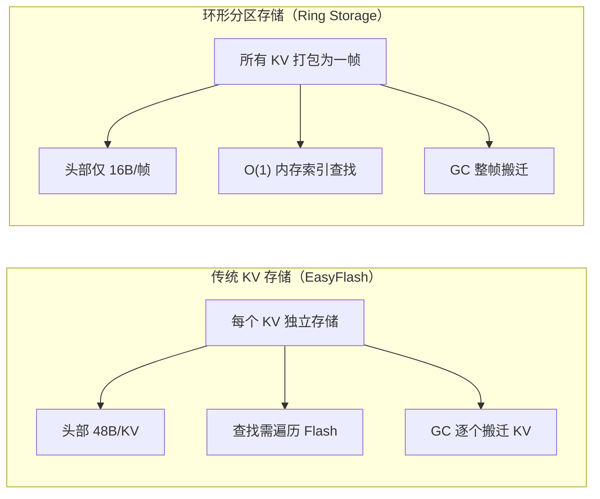
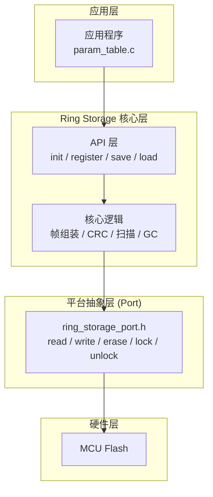
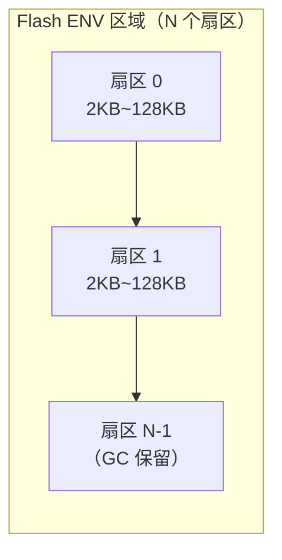
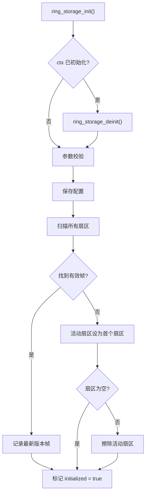
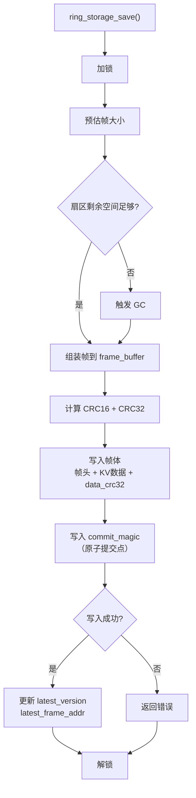
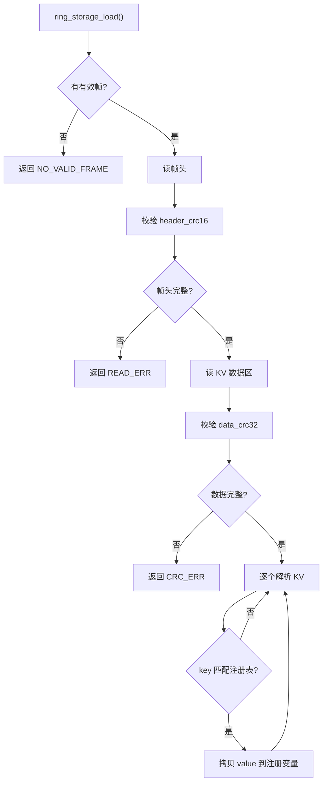
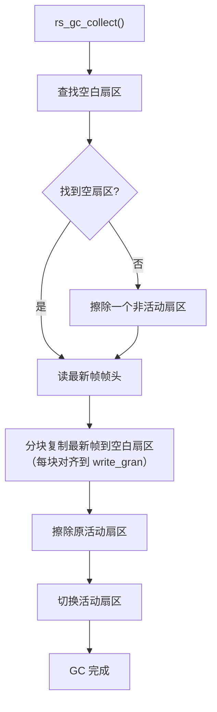
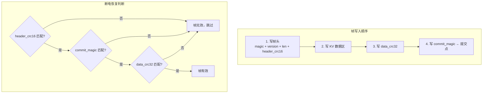
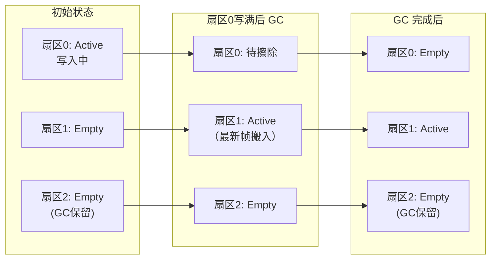

# Ring Storage

嵌入式 Flash 参数存储库 —— 环形缓冲区分区设计，专为 MCU 参数持久化优化。

> 适用于 STM32G4/G0/H7、AT32、GD32 等 Cortex-M MCU，支持 8~256bit 写入颗粒度。

---

## 目录

- [设计原理](#设计原理)
- [数据格式](#数据格式)
- [工作机制](#工作机制)
- [断电保护](#断电保护)
- [磨损均衡](#磨损均衡)
- [API 参考](#api-参考)
- [使用示例](#使用示例)
- [移植指南](#移植指南)
- [性能分析](#性能分析)
- [适用场景](#适用场景)

---

## 设计原理

### 核心思想

将**所有参数打包为一个完整帧**，以**追加写入**方式存入 Flash，通过**版本号**区分新旧，通过**扇区轮转**实现磨损均衡。

与传统 KV 存储（如 EasyFlash）的对比：



### 架构分层



---

## 数据格式

### Flash 布局



每个扇区内部是**顺序追加**的帧序列：

```
扇区起始
  │
  ├── 帧 v1 [帧头 16B | KV数据 | 帧尾 8B]
  ├── 帧 v2 [帧头 16B | KV数据 | 帧尾 8B]
  ├── 帧 v3 [帧头 16B | KV数据 | 帧尾 8B]
  │   ...
  ├── 帧 vN [帧头 16B | KV数据 | 帧尾 8B]
  └── 0xFF 0xFF 0xFF ...  (空白区域)
```

### 帧结构

```
偏移    字段              大小      说明
──────────────────────────────────────────────────────
 0     magic             4B       0x46524E47 ("FRNG") 帧起始标志
 4     version           4B       单调递增版本号
 8     frame_len         4B       帧总长度（含帧头帧尾）
12     kv_count          2B       KV 条目数量
14     header_crc16      2B       帧头 CRC16（magic ~ kv_count）
──────────────────────────────────────────────────────
16     KV 数据区         变长      紧凑 TLV 格式
──────────────────────────────────────────────────────
N     data_crc32        4B       KV 数据区 CRC32
N+4   commit_magic      4B       0x434F4D54 ("COMT") 原子提交点
──────────────────────────────────────────────────────
      固定开销 = 16B 帧头 + 8B 帧尾 = 24B
```

### KV 数据区格式（紧凑 TLV）

```
┌──────────┬──────────────┬──────────┬───────────────┐
│ key_len  │    key       │ val_len  │    value      │
│  1 byte  │  key_len B   │  2 byte  │  val_len B    │
└──────────┴──────────────┴──────────┴───────────────┘
```

**空间对比示例**（保存 `motor_poles=11`，key 10B + value 1B）：

| 方案 | 头部 | key | value | 对齐填充 | 总计 |
|------|------|-----|-------|---------|------|
| EasyFlash (64bit) | 48B | 16B | 8B | - | **72B** |
| Ring Storage (64bit) | 24B(分摊) | 10B | 1B | 1B(帧对齐) | **~15B** |

---

## 工作机制

### 初始化流程



### 保存流程



### 加载流程



### GC（垃圾回收）流程



---

## 断电保护

### 三重校验机制



### 断电场景分析

| 断电时机 | Flash 状态 | 恢复行为 |
|---------|-----------|---------|
| 写帧头中断 | magic 不完整 | magic ≠ 0x46524E47 → 跳过该帧 |
| 写帧头后、KV 数据中断 | header_crc16 匹配但数据不全 | commit_magic 缺失 → 跳过该帧 |
| 写 data_crc32 中断 | data_crc32 不完整 | commit_magic 缺失 → 跳过该帧 |
| 写 commit_magic 中断 | commit_magic 不完整 | commit_magic ≠ 0x434F4D54 → 跳过该帧 |
| commit_magic 写入完成 | 帧完整 | 帧有效，正常加载 |

**关键设计**：`commit_magic` 是最后写入的字段，作为**原子提交点**。只要 commit_magic 不完整，整个帧就会被跳过，回退到上一个有效版本。

---

## 磨损均衡

### 扇区轮转策略



### GC 效率

- **只搬迁最新帧**：不遍历所有历史帧，直接复制 `latest_frame_addr` 对应的一个帧
- **整扇区擦除**：擦除操作以扇区为单位，利用 MCU 的批量擦除能力
- **分块对齐写入**：支持帧大于缓冲区的场景，每块对齐到 `write_gran`

---

## API 参考

### 核心类型

```c
/* 错误码 */
typedef enum {
    RING_STORAGE_OK = 0,                /**< 操作成功 */
    RING_STORAGE_ERROR_NULL_PTR,        /**< 空指针 */
    RING_STORAGE_ERROR_INVALID_PARAM,   /**< 无效参数 */
    RING_STORAGE_ERROR_FLASH_READ,      /**< Flash 读取失败 */
    RING_STORAGE_ERROR_FLASH_WRITE,     /**< Flash 写入失败 */
    RING_STORAGE_ERROR_FLASH_ERASE,     /**< Flash 擦除失败 */
    RING_STORAGE_ERROR_BUFFER_TOO_SMALL,/**< 缓冲区不足 */
    RING_STORAGE_ERROR_NO_VALID_FRAME,  /**< 无有效帧 */
    RING_STORAGE_ERROR_CRC_MISMATCH,    /**< CRC 校验失败 */
    RING_STORAGE_ERROR_GC_FAILED,       /**< GC 失败 */
    RING_STORAGE_ERROR_UNINITIALIZED,   /**< 未初始化 */
} ring_storage_error_t;

/* 配置结构体 */
typedef struct {
    uint32_t start_addr;                /**< Flash 起始地址（须扇区对齐） */
    uint32_t area_size;                 /**< ENV 区域总大小（≥ 2 × sector_size） */
    uint32_t sector_size;               /**< 扇区大小（等于 Flash 擦除单位） */
    uint32_t write_gran;                /**< 写入颗粒度：8/32/64/128/256 (bit) */
    uint8_t* frame_buffer;              /**< 帧组装缓冲区（RAM） */
    size_t frame_buffer_size;           /**< 缓冲区大小（建议 ≥ 256B） */
} ring_storage_config_t;

/* 上下文结构体 */
typedef struct ring_storage_context ring_storage_context_t;
```

### 函数列表

| 函数 | 说明 |
|------|------|
| `ring_storage_init(ctx, config)` | 初始化模块，扫描 Flash 定位最新帧 |
| `ring_storage_deinit(ctx)` | 反初始化，释放资源 |
| `ring_storage_is_initialized(ctx)` | 检查是否已初始化 |
| `ring_storage_register(ctx, key, value_ptr, value_len)` | 注册 KV 变量（绑定指针） |
| `ring_storage_save(ctx)` | 将所有注册 KV 打包保存到 Flash |
| `ring_storage_load(ctx)` | 从 Flash 加载最新帧到注册的 KV 变量 |

---

## 使用示例

### 基本用法

```c
#include "ring_storage.h"

/* 1. 定义帧缓冲区和上下文 */
static uint8_t s_frame_buf[512];
static ring_storage_context_t s_storage;

/* 2. 定义参数变量 */
static uint8_t  g_motor_poles = 11;
static float    g_pid_kp = 1.5f;
static float    g_pid_ki = 0.02f;

/* 3. 配置（以 STM32G4 为例） */
static const ring_storage_config_t s_config = {
    .start_addr        = 0x08078000,   /* Flash 60KB 处 */
    .area_size         = 8192,         /* 8KB (4 扇区) */
    .sector_size       = 2048,         /* STM32G4 页大小 */
    .write_gran        = 64,           /* 双字编程 */
    .frame_buffer      = s_frame_buf,
    .frame_buffer_size = sizeof(s_frame_buf),
};

void param_init(void) {
    ring_storage_init(&s_storage, &s_config);

    /* 注册参数（绑定变量指针） */
    ring_storage_register(&s_storage, "motor_poles", &g_motor_poles, sizeof(g_motor_poles));
    ring_storage_register(&s_storage, "pid_kp",      &g_pid_kp,      sizeof(g_pid_kp));
    ring_storage_register(&s_storage, "pid_ki",      &g_pid_ki,      sizeof(g_pid_ki));

    /* 从 Flash 加载（首次使用返回 NO_VALID_FRAME，使用默认值） */
    ring_storage_error_t err = ring_storage_load(&s_storage);
    if (err == RING_STORAGE_ERROR_NO_VALID_FRAME) {
        /* 首次使用，保存默认值 */
        ring_storage_save(&s_storage);
    }
}

void param_save(void) {
    /* 用户修改参数后调用 */
    ring_storage_save(&s_storage);
}
```

### 重启恢复

```c
/* 重启后：init → register → load
 * Flash 中的数据会自动恢复到注册的变量中 */
void app_init(void) {
    param_init();  /* 内部已处理 load */
    /* g_motor_poles, g_pid_kp, g_pid_ki 已恢复为上次保存的值 */
}
```

---

## 移植指南

### 实现 5 个平台接口

在 `ring_storage_port.h` 中声明，在目标平台实现：

```c
/* 读 Flash */
ring_storage_error_t ring_storage_port_read(uint32_t addr, uint8_t* buf, size_t size);

/* 写 Flash（须按 write_gran 对齐） */
ring_storage_error_t ring_storage_port_write(uint32_t addr, const uint8_t* buf, size_t size);

/* 擦除扇区 */
ring_storage_error_t ring_storage_port_erase(uint32_t addr, size_t size);

/* 加锁（屏蔽中断或获取互斥锁） */
void ring_storage_port_lock(void);

/* 解锁 */
void ring_storage_port_unlock(void);
```

### STM32G4 移植示例

```c
#include "stm32g4xx_hal.h"

#define FLASH_PROGRAM_SIZE 8  /* 64bit 双字 */

ring_storage_error_t ring_storage_port_write(uint32_t addr, const uint8_t* buf, size_t size) {
    HAL_FLASH_Unlock();
    for (size_t i = 0; i < size; i += FLASH_PROGRAM_SIZE) {
        uint64_t data;
        memcpy(&data, buf + i, FLASH_PROGRAM_SIZE);
        if (HAL_FLASH_Program(FLASH_TYPEPROGRAM_DOUBLEWORD, addr + i, data) != HAL_OK) {
            HAL_FLASH_Lock();
            return RING_STORAGE_ERROR_FLASH_WRITE;
        }
    }
    HAL_FLASH_Lock();
    return RING_STORAGE_OK;
}

ring_storage_error_t ring_storage_port_erase(uint32_t addr, size_t size) {
    HAL_FLASH_Unlock();
    FLASH_EraseInitTypeDef init = {
        .TypeErase = FLASH_TYPEERASE_PAGES,
        .Page = (addr - FLASH_BASE) / FLASH_PAGE_SIZE,
        .NbPages = size / FLASH_PAGE_SIZE,
        .Banks = FLASH_BANK_1,
    };
    uint32_t err;
    HAL_StatusTypeDef status = HAL_FLASHEx_Erase(&init, &err);
    HAL_FLASH_Lock();
    return (status == HAL_OK && err == 0xFFFFFFFF) ? RING_STORAGE_OK
                                                   : RING_STORAGE_ERROR_FLASH_ERASE;
}

/* 使用 BASEPRI 屏蔽中断，允许高优先级中断（如 FOC）继续执行 */
static uint32_t s_saved_basepri;
void ring_storage_port_lock(void)   { s_saved_basepri = __get_BASEPRI(); __set_BASEPRI(0x50); }
void ring_storage_port_unlock(void) { __set_BASEPRI(s_saved_basepri); }
```

### 配置参数对照

| MCU | sector_size | write_gran | 备注 |
|-----|------------|------------|------|
| STM32G4 | 2048 | 64 | 双字编程 |
| STM32G0 | 2048 | 64 | 双字编程 |
| STM32F1 | 1024 | 32 | 字编程 |
| STM32F4 | 16384 | 8 | 字节编程（可选 32） |
| STM32H7 | 131072 | 256 | 256bit 编程（建议用小扇区） |
| AT32F425 | 1024 | 32 | 字编程 |

---

## 性能分析

### 空间利用率

**帧大小计算**：`frame_len = 24 (固定开销) + Σ(1 + key_len + 2 + value_len)`

以 30 个 FOC 参数（平均 key 10B + value 4B）为例：

| 指标 | 值 |
|------|-----|
| KV 数据区 | 30 × (1+10+2+4) = 510B |
| 帧总大小（含对齐） | 24 + 510 = 534B → 对齐后 536B (64bit) |
| 8KB Flash (4扇区) 可存帧数 | 3 × 2048 / 536 ≈ **11 帧** |
| 256KB Flash (2扇区) 可存帧数 | 1 × 131072 / 536 ≈ **244 帧** |

### 操作耗时

以 STM32G4（2KB 扇区，64bit 颗粒度，~16μs/双字编程）为例：

| 操作 | 耗时 | 说明 |
|------|------|------|
| 初始化扫描 | ~1ms | 4 扇区 × 扫描帧头 |
| Load | ~30μs | 读 1 帧（~536B） |
| Save（无 GC） | ~1.1ms | 写 536B = 67 双字 × 16μs |
| Save（触发 GC） | ~24ms | 读帧 + 写帧 + 擦除 2KB |

### 与 EasyFlash 对比

| 指标 | EasyFlash NG | Ring Storage | 提升 |
|------|-------------|--------------|------|
| 30 参数固定开销 | 48B × 30 = 1440B | 24B × 1 = 24B | **60x** |
| 单次修改写入量 | 48B + KV = ~62B | 整帧 ~536B | 0.1x（单次） |
| 10 次修改总写入 | 620B + GC | 5360B + 1 次 GC | 相当 |
| 查找速度 | 全扫描/缓存 | O(1) 内存索引 | **10x+** |
| 代码量 | ~1500 行 | ~600 行 | 0.4x |

> **适用判断**：参数数量 < 100 且总量 < 2KB 时，Ring Storage 空间效率和速度均优于 EasyFlash。参数数量 > 200 或频繁新增/删除不同参数时，EasyFlash 更优。

---

## 适用场景

### 推荐

- ✅ FOC 电机参数表（~30 项，< 1KB）
- ✅ PID 参数持久化
- ✅ 设备配置/校准数据
- ✅ 运行计数器/累计运行时间
- ✅ 用户可调参数（通过串口/上位机修改后保存）

### 不推荐

- ❌ 大量 KV（> 100 个）且频繁单独修改
- ❌ 需要按 key 单独删除的场景
- ❌ 单个 value > 1KB 的大对象存储
- ❌ 需要事务性批量写入不同 key 的场景

---

## 文件结构

```
ring_storage/
├── ring_storage.h           # 公共 API（错误码、配置、上下文、函数声明）
├── ring_storage_port.h      # 平台抽象接口（5 个函数需用户实现）
├── ring_storage.c           # 核心实现（CRC、帧打包/解析、扇区扫描、GC）
├── README.md                # 本文档
├── AGENTS.md                # 开发者文档
└── test/
    ├── test_ring_storage.c  # PC 端模拟测试
    ├── debug.h              # 测试用日志 mock
    └── mock_debug.h         # 日志 mock 备份
```
